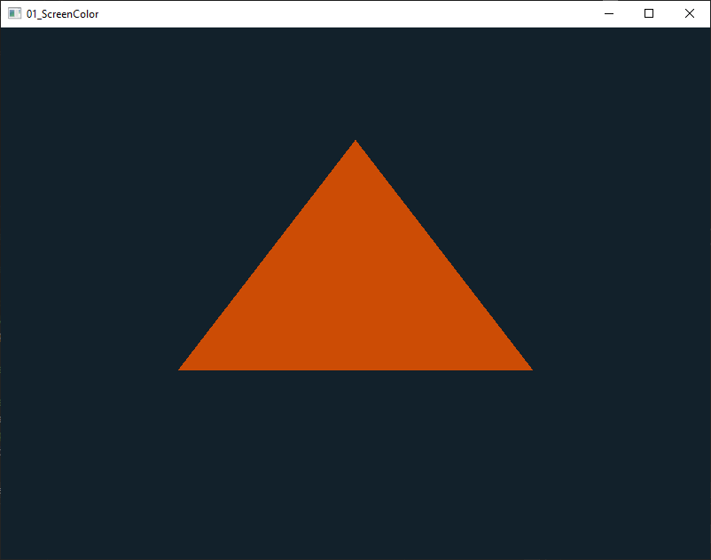

# Greetings

# LDL - Little Directmedia Layer, HOL - Header only library
1. Free for everyone.
2. Consider and accept all ideas.
3. We do not limit the developer.
4. We support old and new platforms.
5. Cross-platform.
6. Simple API.

# Library Features
1. Creating a window.
2. Event management.
3. Drawing 2D graphics. (OpenGL, Software)
4. Supports all versions of OpenGL (1.0 - 4.6).

# Build for Linux
1. sudo apt-get install libx11-dev
2. sudo apt-get install libgl1-mesa-dev
3. git clone https://github.com/JordanCpp/LDL.git
4. cd Lib-LDL
5. cmake. or cmake -Bout
6. make

# Integration into your project (CMake Linux or Windows)
add_subdirectory("LDL")
include_directories("LDL/include")
target_link_libraries(${CMAKE_PROJECT_NAME} LDL)

# Support platforms.
1. Windows 95 and higher. (32 and 64 bit)
2. Linux (Debian 3) and higher.(32 and 64 bit)
3. MS-DOS (16 and 32 bit)

# Support graphics API.
1. OpenGL >= 1.0 and <= 4.6

# Support 2D renders.
1. OpenGL 1.2
2. Software

# The main idea is to write an analogue of the SDL library. 
Accessible to everyone, without exception. 
Under a free license. Add interesting functionality.

# License.
Boost Software License - Version 1.0 - August 17th, 2003

# Support compillers (C++ any standarts)
1. MinGW (gcc 3) and higher
2. GCC 3 and higher
3. Visual C++ 5.0 and higher
4. Open Watcom V2
5. Borland C++ 2.0 and higher

# Example OpenGL 3.3 - Triangle
  

```c++
#define LDL_IMPLEMENTATION
#include <LDL/LDL.hpp>

#include <stdio.h>
#include <math.h>

// Vertex Shader source code
const char* vertexShaderSource = "#version 330 core\n"
"layout (location = 0) in vec3 aPos;\n"
"void main()\n"
"{\n"
"   gl_Position = vec4(aPos.x, aPos.y, aPos.z, 1.0);\n"
"}\0";
//Fragment Shader source code
const char* fragmentShaderSource = "#version 330 core\n"
"out vec4 FragColor;\n"
"void main()\n"
"{\n"
"   FragColor = vec4(0.8f, 0.3f, 0.02f, 1.0f);\n"
"}\n\0";

int main()
{
	LDL_Result result;

	LDL_Window window(&result, LDL_Vec2i(0, 0), LDL_Vec2i(800, 600), "01_ScreenColor");

	if (result.Ok())
	{
		LDL_OpenGLLoader loader(3, 3);

		LDL_Event report;

		// Specify the viewport of OpenGL in the Window
		// In this case the viewport goes from x = 0, y = 0, to x = 800, y = 800
		glViewport(0, 0, (GLsizei)window.Size().x, (GLsizei)window.Size().y);

		// Create Vertex Shader Object and get its reference
		GLuint vertexShader = glCreateShader(GL_VERTEX_SHADER);
		// Attach Vertex Shader source to the Vertex Shader Object
		glShaderSource(vertexShader, 1, &vertexShaderSource, NULL);
		// Compile the Vertex Shader into machine code
		glCompileShader(vertexShader);

		// Create Fragment Shader Object and get its reference
		GLuint fragmentShader = glCreateShader(GL_FRAGMENT_SHADER);
		// Attach Fragment Shader source to the Fragment Shader Object
		glShaderSource(fragmentShader, 1, &fragmentShaderSource, NULL);
		// Compile the Vertex Shader into machine code
		glCompileShader(fragmentShader);

		// Create Shader Program Object and get its reference
		GLuint shaderProgram = glCreateProgram();
		// Attach the Vertex and Fragment Shaders to the Shader Program
		glAttachShader(shaderProgram, vertexShader);
		glAttachShader(shaderProgram, fragmentShader);
		// Wrap-up/Link all the shaders together into the Shader Program
		glLinkProgram(shaderProgram);

		// Delete the now useless Vertex and Fragment Shader objects
		glDeleteShader(vertexShader);
		glDeleteShader(fragmentShader);

		// Vertices coordinates
		GLfloat vertices[] =
		{
			-0.5f, -0.5f * float(sqrt(3)) / 3, 0.0f, // Lower left corner
			0.5f, -0.5f * float(sqrt(3)) / 3, 0.0f, // Lower right corner
			0.0f, 0.5f * float(sqrt(3)) * 2 / 3, 0.0f // Upper corner
		};

		// Create reference containers for the Vartex Array Object and the Vertex Buffer Object
		GLuint VAO, VBO;

		// Generate the VAO and VBO with only 1 object each
		glGenVertexArrays(1, &VAO);
		glGenBuffers(1, &VBO);

		// Make the VAO the current Vertex Array Object by binding it
		glBindVertexArray(VAO);

		// Bind the VBO specifying it's a GL_ARRAY_BUFFER
		glBindBuffer(GL_ARRAY_BUFFER, VBO);
		// Introduce the vertices into the VBO
		glBufferData(GL_ARRAY_BUFFER, sizeof(vertices), vertices, GL_STATIC_DRAW);

		// Configure the Vertex Attribute so that OpenGL knows how to read the VBO
		glVertexAttribPointer(0, 3, GL_FLOAT, GL_FALSE, 3 * sizeof(float), (void*)0);
		// Enable the Vertex Attribute so that OpenGL knows to use it
		glEnableVertexAttribArray(0);

		// Bind both the VBO and VAO to 0 so that we don't accidentally modify the VAO and VBO we created
		glBindBuffer(GL_ARRAY_BUFFER, 0);
		glBindVertexArray(0);

		while (window.Running())
		{
			while (window.GetEvent(report))
			{
				if (report.Type == LDL_Event::IsQuit)
				{
					window.StopEvent();
				}

				if (report.Type == LDL_Event::IsResize)
				{
					glViewport(0, 0, (GLsizei)window.Size().x, (GLsizei)window.Size().y);
				}
			}

			// Specify the color of the background
			glClearColor(0.07f, 0.13f, 0.17f, 1.0f);
			// Clean the back buffer and assign the new color to it
			glClear(GL_COLOR_BUFFER_BIT);
			// Tell OpenGL which Shader Program we want to use
			glUseProgram(shaderProgram);
			// Bind the VAO so OpenGL knows to use it
			glBindVertexArray(VAO);
			// Draw the triangle using the GL_TRIANGLES primitive
			glDrawArrays(GL_TRIANGLES, 0, 3);

			window.Present();
			window.PollEvents();
		}

		// Delete all the objects we've created
		glDeleteVertexArrays(1, &VAO);
		glDeleteBuffers(1, &VBO);
		glDeleteProgram(shaderProgram);
	}
	else
	{
		printf("%s/n", result.Message());
	}

	return 0;
}
```

# Example OpenGL 1.2 - Screen color

```c++
#define LDL_IMPLEMENTATION
#include <LDL/LDL.hpp>

#include <stdio.h>

int main()
{
	LDL_Result result;

	LDL_Window window(&result, LDL_Vec2i(0, 0), LDL_Vec2i(800, 600), "test.cpp", LDL_WindowMode::Resized);

	if (result.Ok())
	{
		LDL_OpenGLLoader loader(1, 2);

		LDL_Event report;

		while (window.Running())
		{
			while (window.GetEvent(report))
			{
				if (report.Type == LDL_Event::IsQuit)
				{
					window.StopEvent();
				}
			}

			glClearColor(0.0f, 3.0f, 0.0f, 0.5f);
			glClear(GL_COLOR_BUFFER_BIT | GL_DEPTH_BUFFER_BIT);

			window.Present();
			window.PollEvents();
		}
	}
	else
	{
		printf("%s/n", result.Message());
	}

	return 0;
}
```